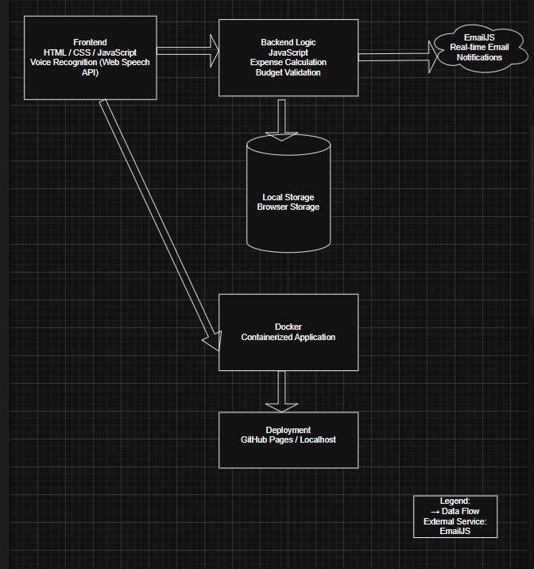
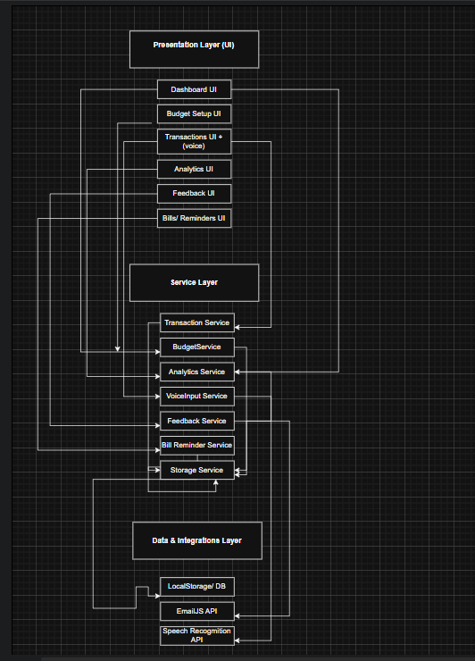
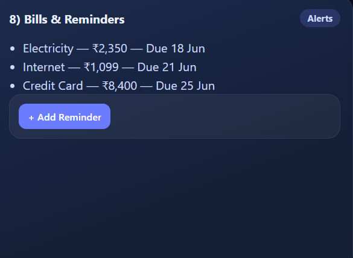

# Budget Tracker Web Application

## Project Overview
The Budget Tracker Web Application is a web-based system that helps users track their income, expenses, and monthly budgets efficiently. The application provides insights into spending habits using categorized expenses, visual analytics, and smart feedback mechanisms.

A key novelty of this project is the integration of **voice recognition for hands-free expense entry** and **real-time feedback using EmailJS**, making the system more interactive and user-friendly.

---

## Problem It Solves
Many individuals struggle to manage personal finances due to manual effort, lack of reminders, and poor visibility into spending patterns. Traditional budget trackers require typing every entry and do not provide proactive feedback.

This application solves these issues by enabling quick expense entry through voice commands and sending real-time feedback or alerts via email when spending crosses predefined limits.

---

## Target Users (Personas)

### 1. College Students
Students who want to manage pocket money easily and receive alerts when they overspend.

### 2. Working Professionals
Professionals who want fast expense logging using voice input and timely financial feedback via email.

### 3. Families
Households that want structured expense tracking with automated notifications and summaries.

---

## Vision Statement
To empower users to take control of their finances through intelligent, interactive, and accessible budget tracking using voice technology and real-time feedback.

---

## Key Features / Goals
- Add and manage income and expenses
- Categorize expenses (food, travel, shopping, etc.)
- Set monthly budget limits
- Voice-based expense entry using speech recognition
- Real-time email notifications and feedback using EmailJS
- Visual analytics using charts and summaries
- Simple, responsive, and user-friendly interface

---

## Novelty / Innovation
- Voice recognition to add expenses without manual typing
- Real-time feedback and alerts sent via email using EmailJS
- Enhanced user interaction compared to traditional budget trackers

---

## Success Metrics
- Users successfully log expenses using voice input
- Timely email alerts are received when budget limits are exceeded
- Improved user awareness of spending habits
- Smooth and responsive application performance

---

## Assumptions
- Users have access to a microphone-enabled device
- Users have a valid email address for notifications
- Modern web browser support is available
  ---

## MoSCoW Prioritization

### Must Have
- User account creation and login
- Add income and expenses
- Monthly budget setup
- Expense categorization
- Voice-based expense entry
- Persistent data storage
- Basic analytics and summaries

### Should Have
- Email alerts on overspending using EmailJS
- Category-wise charts and visual reports
- Responsive design for mobile devices

### Could Have
- Dark mode support
- Export expense data
- Advanced spending insights

### Won’t Have (For Now)
- Direct bank integration
- AI-based financial recommendations
- Multi-currency support

---

## Constraints
- Uses free APIs and services (EmailJS free tier)
- Limited cloud and hosting resources
- No direct bank or payment gateway integration
 ## Wireframes (Figma)
Low-fidelity wireframes for the Budget Tracker application (6 screens):
https://www.figma.com/design/vh2wdW91lnJCMju5fxdstt/Budget-Tracker--WireFrames?node-id=0-1&t=wiBZdPiVpBM5giFf-1

---

## Architecture Diagram
The following diagram shows the high-level architecture of the Budget Tracker application.

## Software Design

### Architecture Diagram

## User Interface Design

The application consists of the following UI screens:

- Landing Page  
- Dashboard  
- Add Expense (Voice Feature)  
- Transactions  
- Budget Setup  
- Analytics  
- Feedback (EmailJS Integration)  
- Bills & Reminders (Target Date Alerts)  

### Screens

## 🎨 UI Design Screens (Figma)

###  Landing Page
.png)

### Dashboard
.png)

### Add Expense
.png)

### Transactions
.png)

### Budget Setup
.png)

### Analytics
.png)

### Real-Time Feedback
.png)

### Voice-Based Transactions
.png)

### Bills & Reminders

### Interactive Prototype

The interactive prototype can be accessed here:

https://www.figma.com/design/0Tux13yRhzTGhUMNpD0XFJ/Untitled?node-id=12-44&t=xq3I0jhW3Q94tycF-1

